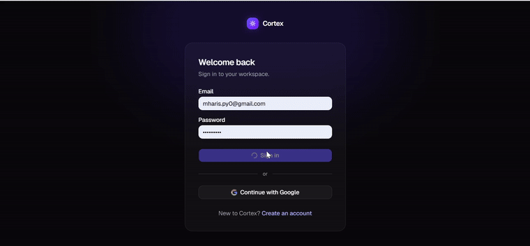
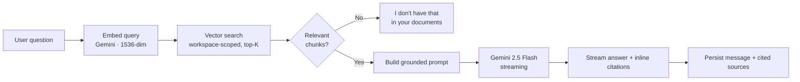

<div align="center">

# 🧠 Cortex

### Chat with your documents — a multi-tenant RAG SaaS that answers questions from your own files, with citations.

[](https://nextjs.org/)
[](https://www.typescriptlang.org/)
[](https://supabase.com/)
[](https://ai.google.dev/)
[](https://www.netlify.com/)

**[🌐 Live Demo](https://getcortex.netlify.app)** &nbsp;·&nbsp; **[📹 Demo Video](#-demo)** &nbsp;·&nbsp; **[🏗️ Architecture](#️-architecture)**

</div>

---

## What is Cortex?

Cortex is a **retrieval-augmented knowledge assistant for teams**. Upload your documents, then ask natural-language questions that are answered **only from the content you provided** — every response grounded in your actual files and cited inline, so you can trust and verify each answer.

It's built as a real, production-grade, **multi-tenant SaaS** — auth, isolated workspaces, an asynchronous ingestion pipeline, vector search, and streaming AI chat — running end-to-end on a **fully zero-cost stack**.

> **Why it exists:** general-purpose chatbots hallucinate and can't see your private documents. Cortex answers strictly from your knowledge base and shows its sources, which is what makes it trustworthy for real work.

<div align="center">

> 📹 _Demo recording coming soon — ask a question, watch a cited answer stream back in real time._

</div>

---

## ✨ Features

- 🔐 **Authentication & multi-tenant workspaces** — sign-up/sign-in, team workspaces with role-based membership and invites.
- 📄 **Document ingestion pipeline** — upload PDF, TXT, or Markdown; Cortex extracts, chunks, embeds, and indexes them automatically.
- 💬 **RAG chat with inline citations** — answers stream token-by-token and cite the exact source passages they're drawn from.
- 🛡️ **Tenant isolation enforced at the database layer** — one workspace can never see another's data, **verified by impersonation testing**.
- ⚡ **Real-time UI** — document processing status and chat history update live, no refresh required.
- ♻️ **Content-hash deduplication** — re-uploading an identical file reuses existing embeddings instead of paying to recompute them.
- 🚫 **Anti-hallucination guardrail** — if the answer isn't in your documents, Cortex says so instead of making something up.

---

## 📹 Demo

<div align="center">



</div>

---

## 🏗️ Architecture

Cortex has two core flows: an **asynchronous ingestion pipeline** that turns documents into searchable vectors, and a **retrieval-augmented chat** flow that answers questions from them.

### Document ingestion

```mermaid
flowchart LR
    A[User uploads file] --> B[Signed URL to private Storage]
    B --> C[Insert document row<br/>status: pending]
    C --> D[Postgres pg_net trigger]
    D --> E[Supabase Edge Function]
    E --> F[Extract text]
    F --> G[Chunk<br/>400 tokens / 50 overlap]
    G --> H[Embed each chunk<br/>Gemini · 1536-dim]
    H --> I[(pgvector + HNSW index)]
    I --> J[status: ready]
```



### RAG chat



### Multi-tenancy

Every tenant-scoped table carries a `workspace_id` and is protected by **Row-Level Security** policies that gate access through a `SECURITY DEFINER` membership check. The workspace is the hard tenant boundary — a user who is not a member of a workspace retrieves **zero rows** from it, which is verified at the database level by impersonating a non-member and confirming the empty result.

---

## 🧰 Tech Stack

| Layer | Technology |
| :--- | :--- |
| **Framework** | Next.js 15 (App Router), TypeScript (strict) |
| **UI** | Tailwind CSS, shadcn/ui, Framer Motion |
| **Database** | Supabase Postgres + `pgvector` (HNSW index) |
| **Auth / Storage / Realtime** | Supabase Auth, Storage, Realtime, Row-Level Security |
| **Async processing** | Supabase Edge Functions (Deno) + `pg_net` triggers |
| **AI** | Google Gemini — `gemini-embedding-001` (embeddings) · `gemini-2.5-flash` (generation) |
| **Hosting** | Netlify (Edge runtime for streaming) |

---

## 🔬 Engineering Highlights

The parts I'm most proud of — the decisions that make Cortex a real system rather than a toy:

- **Tenant isolation proven, not assumed.** RLS policies are backed by an automated test suite *and* verified by impersonating users at the database layer (non-member → 0 rows; member → their rows only). Cross-tenant retrieval is blocked by a **two-guard** design: RLS *plus* an explicit `workspace_id` filter inside the vector-search function.
- **Decoupled, non-blocking ingestion.** Uploads return instantly; a Postgres `pg_net` trigger hands off to an Edge Function so embedding work never blocks the request. Document status streams back to the UI over Realtime.
- **Cost-aware by design.** Content-hash deduplication means an identical re-upload reuses existing embeddings (verified by byte-identical vectors) instead of spending API quota. The whole stack runs on free tiers.
- **Grounded, auditable citations.** The model is constrained to the retrieved context; citations are filtered to only those actually referenced in the answer, so every stored message is fully auditable and refusals carry no phantom sources.
- **True token streaming.** Chat runs on Netlify's Edge runtime so answers flush to the browser token-by-token, with a "searching → writing" thinking indicator for a live, responsive feel.
- **Swappable model providers.** Generation and embeddings sit behind clean `LLMProvider` / `EmbeddingProvider` interfaces, so adding a premium model tier later is a new file, not a rewrite.

---

## 🚀 Local Development

```bash
# 1. Clone
git clone https://github.com/mharispy0-a11y/cortex.git
cd cortex

# 2. Install
npm install

# 3. Configure environment (see below)
cp .env.example .env.local

# 4. Run
npm run dev
```

### Environment variables

```env
NEXT_PUBLIC_SUPABASE_URL=your-project-url
NEXT_PUBLIC_SUPABASE_ANON_KEY=your-anon-key
SUPABASE_SERVICE_ROLE_KEY=your-service-role-key
GEMINI_API_KEY=your-gemini-api-key          # https://aistudio.google.com/app/apikey
PROCESS_DOCUMENT_SECRET=your-shared-secret  # gates the ingestion Edge Function
```

> Database migrations live in `db/migrations`. The `documents`, `chats`, and `messages` tables use `REPLICA IDENTITY FULL` so Realtime delivers filtered UPDATE/DELETE events.

---

## 🗺️ Roadmap

- [x] Auth & multi-tenant workspaces
- [x] Document ingestion (PDF / TXT / Markdown)
- [x] RAG chat with streaming + inline citations
- [x] Tenant isolation (RLS, verified)
- [x] Real-time document & chat updates
- [ ] Subscription billing & usage-based tiers (Stripe)
- [ ] Premium model tier (Claude / GPT via the provider seam)
- [ ] Usage analytics dashboard

---

## 👤 Author

**Muhammad Haris** — AI Engineer & Full-Stack Developer, building under **OrchestAI**.

- 💼 LinkedIn: [linkedin.com/in/muharis-ai](https://linkedin.com/in/muharis-ai)
- 🐙 GitHub: [@mharispy0-a11y](https://github.com/mharispy0-a11y)

> Cortex is a portfolio project demonstrating production patterns for multi-tenant, AI-native SaaS — retrieval-augmented generation, vector search, tenant isolation, and real-time UX.

---

<div align="center">

_Built with Next.js, Supabase, and Google Gemini._

</div>
